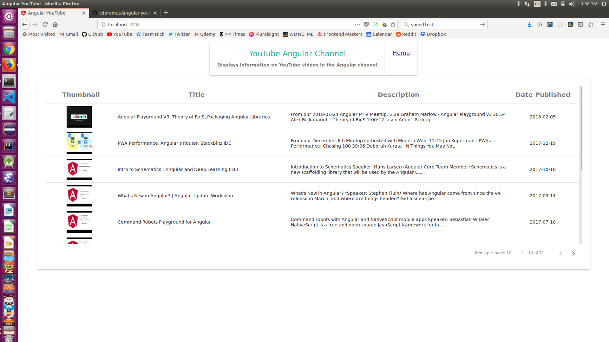
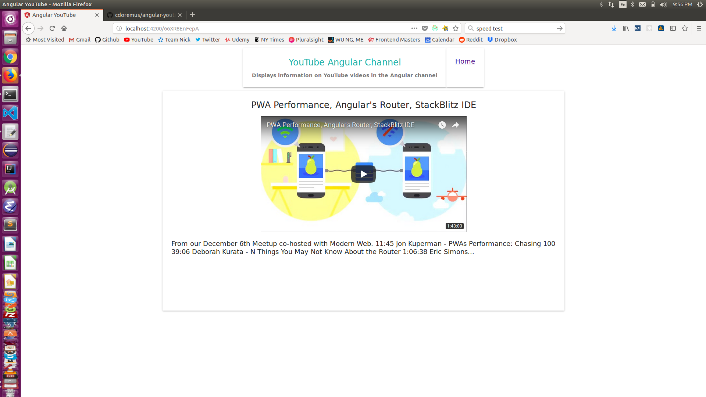

# Angular YouTube

The focus of this application is the display of information from the [Angular channel on YouTube](https://www.youtube.com/user/angularjs) using the [Angular UI framework](https://angular.io) and [Angular Material](https://material.angular.io) components. Application state management is handled by [NgRedux](https://github.com/angular-redux/store).

## Project Structure

The application uses the following Angular components and services:

- `MatTable` - the Angular Material component that displays the video data.

- `VideoTableDataSource` - a service that provides data for the `MatTable` component. This class extends the `DataSource` class from the [Angular Component Development Kit](https://material.angular.io/cdk/categories) and obtains video data and metadata using the `VideoTableService`. This service also sets up an `Observable` loading$ property used for displaying a `MatProgressSpinner` component as a data loading indicator.

- `VideoTableService` - a service that uses Angular's `HttpClient` to get the video data via an HTTP Get request to the [YouTube Data API](https://developers.google.com/youtube/v3/). Domain model interfaces residing in the `model.ts` file represent the YouTube API HTTP response data containing the video information and metadata encapsulated in the `YouTubeApiResponse` interface. This interface contains an array of `Video` objects which hold the data displayed in the data table. Note that the `Video.description` field is truncated to 150 characters in each data table row to save space.

- `MatPagination` - the Angular Material component used to paginate the video data displayed by the `MatTable` component. Metadata used by this component is contained in a `YouTubeApiResponse` object that populates the appropriate fields in the `VideoTableDataSource` service.

- `VideoTableComponent` - a custom component that is a container for the `MatTable` and `MatPagination` components. This component and related services and models are packaged in the Angular module `VideoTableModule` to promote encapsulation and reusability.

- `ErrorHandlerService` - extends the Angular `ErrorHandler` class to capture application errors and provide logging and a UI alert containing a non-technical message for the user if an error occurs.

- `AppRoutingModule` - defines and sets up application routing to the `VideoTableComponent` as the app's default path.

- `VideoDetailsComponent` - used to display an individual video and its details in a separate page when a row in the video table is clicked. The video is displayed in an IFRAME to allow the user to play the video published on the YouTube site.

- `NgRedux` - a third party implementation of the [Redux](https://redux.js.org/) architectural pattern used to manage application state. The redux store is configured in `AppModule` to hold state defined in the `AppState` interface in `redux/root.ts`. The same file holds the reducer implementation (called `rootReducer`). All actions and action creators are located in the `redux/actions.ts` file.  `AppState` holds the current `Video` object to be displayed on the video details page and a cache of API response objects keyed by pageToken used to prevent duplicate http requests for video table data. Redux action and action creators are defined as TypeScript interfaces to promote type safety. `NgRedux` is also configured to run the Redux Dev Tools extensions for Chrome and Firefox when the application is in development mode to aid debugging.

## Project setup

To create and run the application, clone this repository (or unzip the code archive), and invoke `npm install` to install the project's dependencies. This and the following `npm` commands need to be executed in the project's root folder.

## Running the Application in the Development Server

In order to run the application, you need to put a `keys.js` file in a project root folder named `private`. The file will contain your YouTube Data API key. The code in the file should look like this:
```
export const secrets = {
  apikey: 'YouTube Data API key here'
};
```

Run `npm start` to build the application and start the development server and browse to [http://localhost:4200/](http://localhost:4200/) to view the application. The app will automatically reload if you change any of the source files.

## Running Unit Tests

Execute `npm test` to run the unit tests via [Karma](https://karma-runner.github.io) in watch mode.

Execute `npm run code-coverge` to run the unit tests and collect code coverage data. Once the test run is finished an HTML code coverage report can be found in `code-coverage/index.html`.

## Running End-to-End Tests

Run `npm run e2e` to execute the end-to-end tests via [Protractor](http://www.protractortest.org/).

## Production Build

Run `npm run build` to build the project for production. The build artifacts will be stored in the `dist/` directory.

## Project Scaffolding

This project was created with [Angular CLI](https://github.com/angular/angular-cli) version 1.7.3.

## Screenshots

**Video data table page**


**Video details page displaying video after clicking on the second row of the data table**


## TODOs
Additional work can be done on the project beyond its original requirements to make it more useful. This includes:

- Move the YouTube Data API key into an environmental variable set at the command line.

- Implement a logging service that connects with a server-side alerting service like Sentry.

- Create header, footer and navigation components to aid `AppComponent` layout and functionality.

- Use CSS media queries to adapt the layout of the video table (and any new pages) to small screens.

- Improve styling based on the application owner's design requirements.
